# Student Management System — AI Architecture & Flow Guide

This document explains the **AI part of the Student Management System** as a complete end-to-end flow.

It focuses on:

- where the **LLM** is used,
- where the **AI Agent** is used,
- where normal **C# application code** is used,
- where **AG-UI**, **Hosted Agents**, **Hosted Tools**, **Tools**, **Skills**, **RAG**, **Workflows**, **HITL**, **Sessions**, **Checkpoints**, and **SQL persistence** are used,
- what role each concept plays,
- and how each concept makes the application easier, safer, or more reliable.

> **Implementation status:** This guide distinguishes between features that are implemented now and features that are planned next. In particular, the durable Enrollment Workflow exists today, but Copilot enrollment still uses the normal `enroll_student` tool path; connecting that Copilot action to the durable workflow is a planned integration.

## Quick Navigation

- [Main runtime architecture](#1-main-ai-architecture)
- [Tool calling and hosted tools](#6-ai-tool-calling-flow)
- [Current Copilot tool surface](#7b-current-copilot-tool-surface)
- [Skills and RAG](#8-agent-skills-flow)
- [HITL, sessions, isolation, and AG-UI](#15-agent-hitl-flow)
- [Durable MAF workflow architecture](#20-maf-workflow-architecture)
- [Complete examples](#28-complete-ai-example--attendance-eligibility)
- [Current vs planned architecture](#34a-current-implementation-vs-planned-integration)
- [AI roadmap](#34b-ai-roadmap)

---

# 1. Main AI Architecture

The **primary interactive Copilot runtime** is the Angular application connected to a named, singleton MAF `AIAgent` through **AG-UI**. The older REST `CopilotController` / `CopilotService` path is still retained as an alternate API, but it is not the main Angular Copilot path.

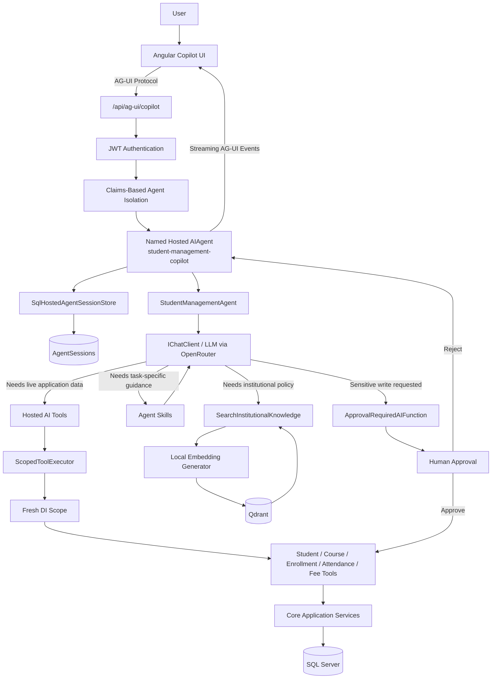

## Alternate REST Copilot Path

The earlier REST Copilot implementation is still available for direct API use and compatibility:

```text
Client
  ↓
CopilotController
  ↓
CopilotService
  ↓
StudentManagementAgent
  ↓
Tools / Skills / RAG / HITL
```

The two paths share the same core AI concepts, but the Angular Copilot uses the hosted AG-UI runtime described above.

---

# 2. What Each Main Component Does

| Component | What it does | Why it exists | AI or Normal Code? |
|---|---|---|---|
| User | Sends a natural-language request | Entry point | Human |
| Angular Copilot UI | Presents chat, approvals, and conversation history | Main interactive frontend | Normal TypeScript |
| AG-UI Server | Streams agent runs, messages, tool calls, and approval-related events | Standard agent-to-UI protocol boundary | MAF integration |
| JWT Authentication | Identifies the current user | Security boundary | Normal C# |
| Claims-Based Agent Isolation | Isolates hosted sessions using the authenticated user claim | Prevents cross-user session resolution | MAF hosting |
| Named Hosted `AIAgent` | Hosts the Copilot as `student-management-copilot` | Long-lived AG-UI agent runtime | MAF hosting |
| `StudentManagementAgent` | Gives the LLM instructions, tools, context providers, and skills | Main AI-agent definition | AI Framework |
| `IChatClient` / LLM | Understands language, reasons, and chooses capabilities | Dynamic decision making | AI |
| Hosted Tools | Proxy singleton-hosted tool calls into a safe scoped execution | Solves DI lifetime mismatch | Normal C# exposed to AI |
| `ScopedToolExecutor` | Creates a fresh DI scope for each hosted tool call | Safe scoped services / repositories / DbContext usage | Normal C# |
| Business Tools | Expose authoritative application capabilities | Keep the LLM away from direct SQL access | Normal C# exposed to AI |
| Core Services | Enforce application business rules | Deterministic domain behavior | Normal C# |
| Skills | Load task-specific guidance | Reduce global prompt size | AI guidance |
| RAG | Retrieves institutional knowledge | Grounds policy answers | AI + retrieval |
| Qdrant | Stores and searches vectors | Semantic knowledge retrieval | Infrastructure |
| Agent HITL | Pauses approval-required tool execution | Human authorization boundary | AI Framework + Human |
| SQL Agent Sessions | Persist serialized hosted-agent state | Conversation continuity and approval resume | SQL |
| Copilot Conversation Metadata | Stores titles, thread IDs, and run metadata | Efficient conversation list / rename / delete UI | SQL |
| Workflow | Deterministic multi-step business process | Explicit process control | MAF Workflow |
| Workflow HITL | Pauses workflow at a `RequestPort` | Human decision inside durable process | MAF Workflow + Human |
| Checkpoint | Saves workflow execution state | Durable pause / restore / resume | MAF Workflow |
| SQL Workflow Persistence | Stores checkpoints and workflow metadata | Survive restart | SQL |
| Legacy `CopilotController` / `CopilotService` | Earlier REST Copilot API | Compatibility and direct REST access | Normal C# + AI orchestration |

---

# 3. Where the LLM Actually Plays a Role

The LLM is **not responsible for everything**.

Its main responsibilities are:

```text
Natural language understanding
        ↓
Intent detection
        ↓
Reasoning
        ↓
Tool selection
        ↓
Skill selection
        ↓
Combining retrieved evidence
        ↓
Generating human-readable response
```

The LLM should **not** directly:

```text
Read SQL tables itself
Write to SQL directly
Invent student data
Invent institutional policy
Skip validation rules
Bypass human approval
Control deterministic workflow rules
```

---

# 4. LLM Role — Detailed Flow

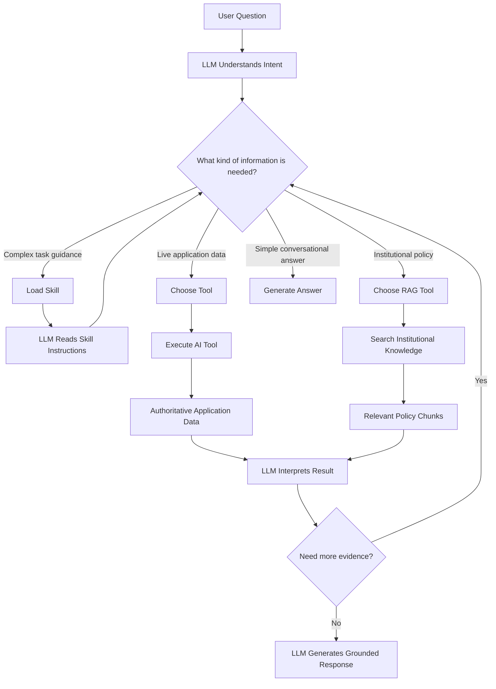

---

# 5. How the LLM Makes the Application Easier

Without AI:

```text
User must know exact API endpoint
User must know exact IDs
User must understand database fields
User must manually combine data from multiple screens
```

With the LLM:

```text
User says:
"Can student 1 sit the final exam?"

LLM understands that this requires:
1. Student lookup
2. Attendance summary
3. Institutional attendance policy
4. Comparison
5. Natural-language conclusion
```

So AI reduces the user's need to understand the internal system structure.

The LLM becomes a **natural-language orchestration layer**, not a replacement for the application itself.

---

# 6. AI Tool Calling Flow

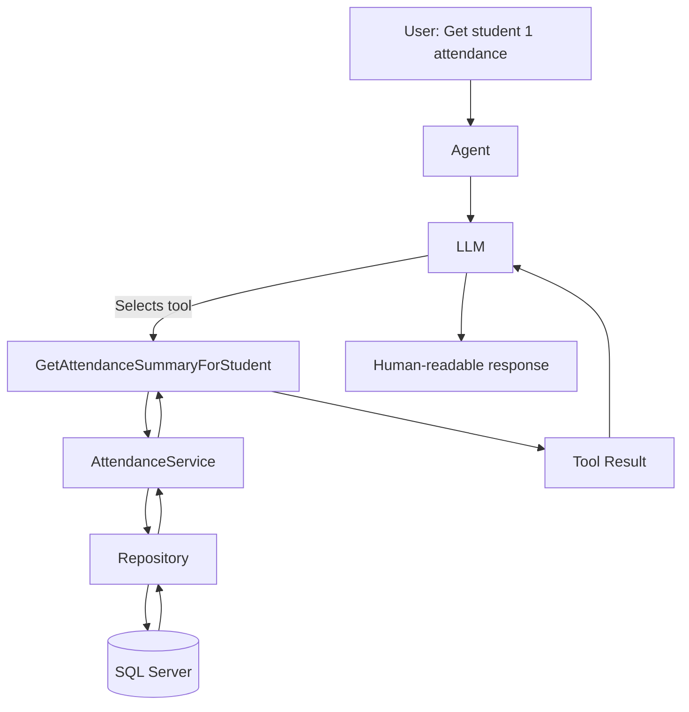

## Concept Used

```text
AIFunctionFactory.Create(...)
```

Normal C# methods are exposed as AI-callable functions.

Example conceptually:

```text
GetStudentById
GetCourseById
GetFeeStatement
GetAttendanceSummaryForStudent
```

## Role of AI

AI decides:

```text
Which tool is needed?
Do I need another tool?
How should I explain the result?
```

## Role of C#

C# decides:

```text
How data is actually retrieved
How validation works
How SQL is accessed
```

---

# 7. Why Tools Are Important

Without tools:

```text
User:
"What is student 1's fee balance?"

LLM:
"Maybe $500?" ❌
```

With tools:

```text
LLM
 ↓
GetFeeStatement
 ↓
SQL-backed application service
 ↓
AmountDue = 1800
AmountPaid = 100
Remaining = 1700
 ↓
LLM
 ↓
"Student has $1,700 remaining."
```

Tools make AI **grounded in real application data**.

---

# 7A. Hosted Tool Architecture

The AG-UI Copilot is registered as a **singleton hosted agent**, while the business services, repositories, and database-related dependencies are scoped. A singleton should not directly hold scoped dependencies for its entire lifetime.

The application therefore uses a hosted-tool proxy layer:

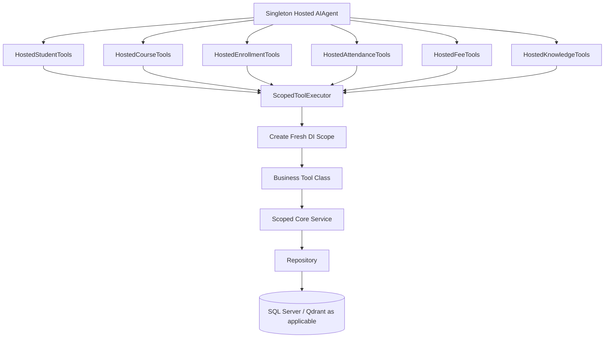

The `HostedStudentManagementToolFactory` assembles these hosted capabilities for the singleton agent. The `Hosted*Tools` classes should stay thin. Their main responsibility is to forward the call through `ScopedToolExecutor`; the real tool behavior remains in `StudentTools`, `CourseTools`, `EnrollmentTools`, `AttendanceTools`, `FeeTools`, and `KnowledgeTools`.

Simple mental model:

```text
Business Tool
= what the capability does

Hosted Tool
= how the singleton hosted agent safely reaches that capability
```

---

# 7B. Current Copilot Tool Surface

The current Copilot exposes both read-only and approval-required write capabilities.

| Module | Tool | Type | HITL Required? |
|---|---|---|---|
| Students | `GetStudentById` | Read | No |
| Students | `GetStudentByRollNumber` | Read | No |
| Students | `SearchStudentsByName` | Read | No |
| Students | `create_student` | Write | Yes |
| Students | `update_student_profile` | Write | Yes |
| Students | `remove_student` | Write | Yes |
| Courses | `GetCourseById` | Read | No |
| Courses | `GetCourseByCode` | Read | No |
| Courses | `SearchCoursesByName` | Read | No |
| Courses | `GetAllCourses` | Read | No |
| Courses | `create_course` | Write | Yes |
| Courses | `update_course_details` | Write | Yes |
| Courses | `update_course_pricing` | Write | Yes |
| Courses | `remove_course` | Write | Yes |
| Enrollments | `GetEnrollmentsByStudent` | Read | No |
| Enrollments | `GetEnrollmentById` | Read | No |
| Enrollments | `GetEnrollmentForStudentCourse` | Read | No |
| Enrollments | `GetEnrollmentsByCourse` | Read | No |
| Enrollments | `enroll_student` | Write | Yes |
| Enrollments | `drop_course` | Write | Yes |
| Enrollments | `complete_course` | Write | Yes |
| Attendance | `GetAttendanceById` | Read | No |
| Attendance | `GetAttendanceForStudent` | Read | No |
| Attendance | `GetAttendanceForCourseOnDate` | Read | No |
| Attendance | `GetAttendanceSummaryForStudent` | Read | No |
| Attendance | `mark_attendance` | Write | Yes |
| Attendance | `mark_attendance_today` | Write | Yes |
| Attendance | `update_attendance` | Write | Yes |
| Fees | `GetFeeById` | Read | No |
| Fees | `GetFeeStatement` | Read | No |
| Fees | `GetFeesForStudent` | Read | No |
| Fees | `process_student_payment` | Write | Yes |
| Institutional Knowledge | `SearchInstitutionalKnowledge` | Read | No |
| Skills | `load_skill` | Read | No |
| Skills | `read_skill_resource` | Read | No |
| Skills | `run_skill_script` | Read | No |

All application write tools are wrapped with `ApprovalRequiredAIFunction`, so the model can request a write but cannot complete it until a human approves the operation.

Collection-returning tools are intentionally used for searches and lists. Exact-ID lookups return one record. Large raw database tables should not be dumped directly into the LLM; filtering, bounding, calculations, and aggregation should stay in SQL/C# whenever practical.

---

# 8. Agent Skills Flow

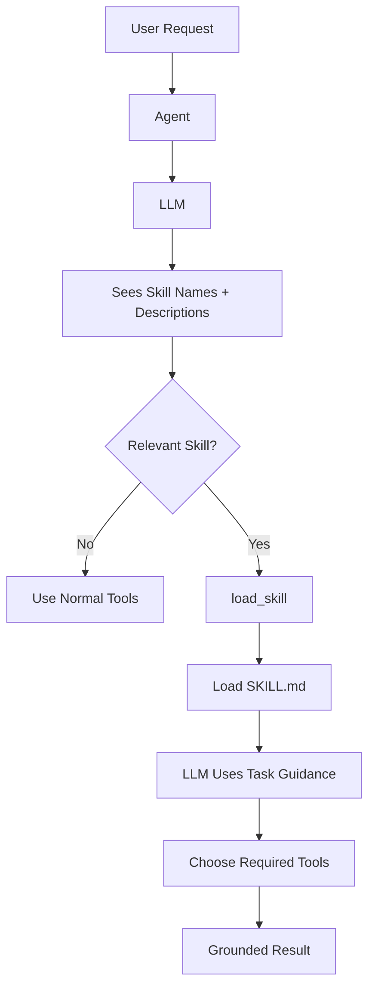

## Concepts Used

```text
AgentSkillsProvider
load_skill
Progressive Disclosure
```

## Why Skills Help

Without skills, the global prompt becomes very large:

```text
Attendance rules
Fee review rules
Future workflow rules
Special task instructions
...
```

With skills:

```text
Global prompt
→ only universal rules

Task-specific rules
→ loaded only when needed
```

## Example

User:

```text
"Can student 1 sit final exam based on attendance?"
```

Flow:

```text
LLM
 ↓
load_skill(attendance-eligibility)
 ↓
GetAttendanceSummaryForStudent
 ↓
SearchInstitutionalKnowledge
 ↓
Final answer
```

---

# 9. RAG Flow

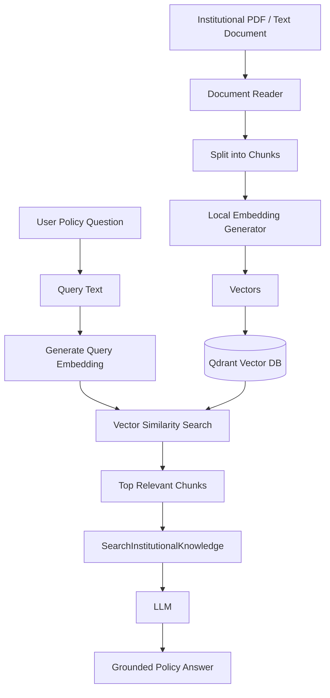

---

# 10. What Role AI Plays in RAG

AI does **not** store policy.

Qdrant does not reason.

The responsibilities are:

```text
Document Reader
→ extracts text

Embedding Model
→ converts meaning into vectors

Qdrant
→ finds semantically similar chunks

LLM
→ reads retrieved chunks and explains them
```

This separation is important.

---

# 11. Why RAG Makes Things Easier

Without RAG:

```text
Developer must hard-code every institutional policy
```

Example:

```csharp
if (attendance < 75)
```

But institutional policy may exist in a handbook.

With RAG:

```text
Handbook document
→ indexed once
→ agent searches it when needed
```

This allows policy knowledge to remain document-driven.

---

# 12. Live Data vs RAG — Important Separation

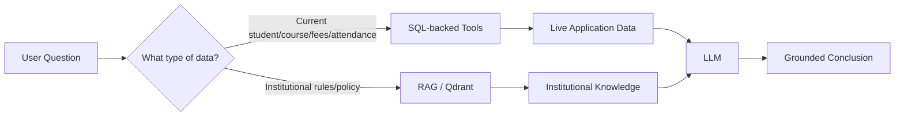

Use:

```text
SQL
→ live operational truth

Qdrant
→ institutional/document knowledge
```

Do not replace one with the other.

---

# 13. Multi-Step Reasoning Flow

Example question:

```text
"Can student ID 1 sit the final examination based on attendance?"
```

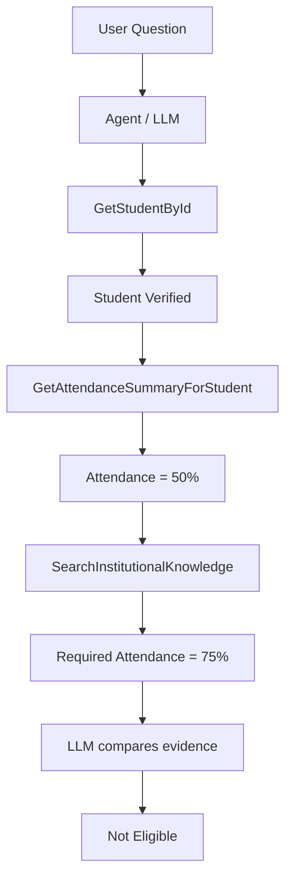

## AI Role

AI decides that one tool is not enough.

It recognizes:

```text
Eligibility conclusion
requires
live attendance
+
policy threshold
```

This is where LLM reasoning is useful.

---

# 14. Evidence Grounding Rules

The LLM is instructed to follow these rules:

```text
Use only retrieved facts
Do not invent policy
Do not infer missing IDs
Check Success before using data
Check Found separately
Do not silently combine conflicting data
Do not invent consequences
```

Important distinction:

```text
Success = false
→ source failed

Success = true, Found = false
→ source worked, data not found
```

---

# 15. Agent HITL Flow

Sensitive write operations use Human-in-the-Loop through `ApprovalRequiredAIFunction`.

In the primary AG-UI Copilot path, the approval request is part of the hosted agent run and is surfaced to the frontend through the agent/AG-UI event stream.

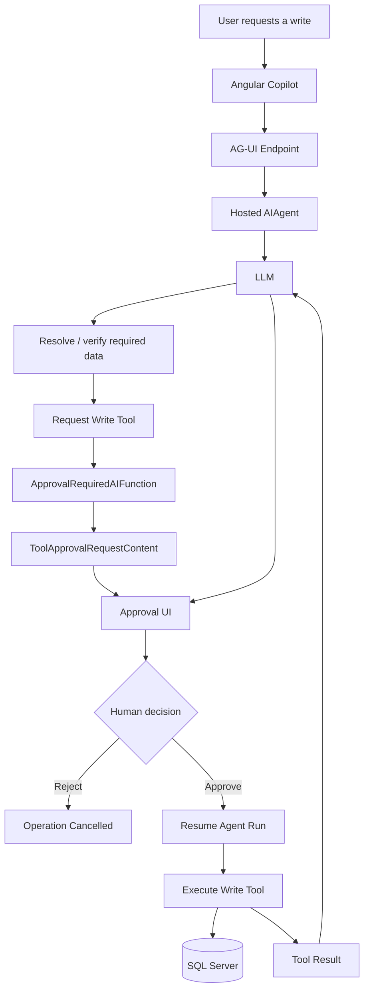

The older REST Copilot path exposes the same approval concept through its REST response/request contract. The authorization principle is the same in both paths:

```text
AI proposes
  ↓
Human authorizes
  ↓
Application executes
```

---

# 16. Why Agent HITL Matters

The LLM may decide:

```text
"This payment should be processed."
```

But the LLM is not the final authority.

The human remains the authorization boundary.

So:

```text
AI proposes
Human approves
Application executes
```

---

# 17. Persistent Agent Session Flow

The primary AG-UI Copilot uses the hosted-agent session store. The frontend works with a `threadId`; the hosted MAF infrastructure resolves the isolated session and the SQL-backed store persists the serialized `AgentSession`.

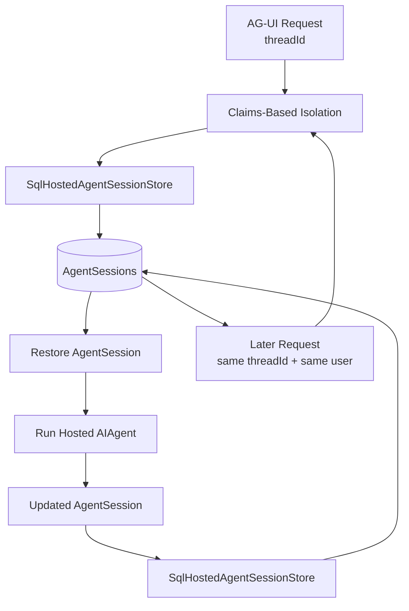

## Concepts Used

```text
AIAgent
AgentSession
AgentSessionStore
SqlHostedAgentSessionStore
ISessionStore / SqlServerSessionStore
Claims-based isolation
```

## Why

Without persistence:

```text
Every HTTP / AG-UI request
→ brand-new conversation
```

With persistence:

```text
User can continue conversation
Tool approval state can be restored/resumed
Application restart does not automatically destroy persisted session state
Conversation history can be reconstructed from the authoritative session
```

---

# 17A. Claims-Based Agent Isolation

Hosted-agent sessions are isolated using the authenticated user's `NameIdentifier` claim.

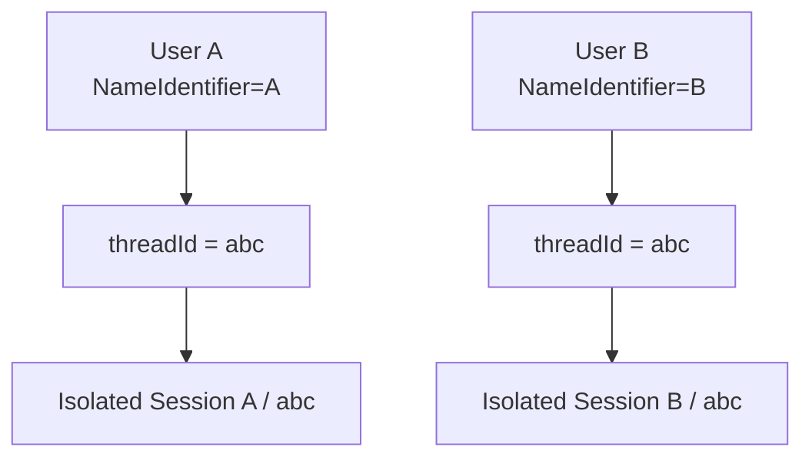

The frontend can therefore use a normal `threadId`. It does **not** need to manually construct composite keys such as:

```text
userId::threadId
```

The hosted session infrastructure applies user isolation before the underlying store resolves the session.

This is a session-isolation boundary; normal application authorization rules must still be enforced by the application itself.

---

# 17B. Agent Session vs Conversation Metadata

The Copilot persists two different kinds of data because they serve different purposes.

```text
AgentSessions
= authoritative serialized MAF agent/session state

CopilotConversations
= lightweight conversation index / UI metadata
```

`AgentSessions` is responsible for the actual persisted conversation state.

`CopilotConversations` stores metadata such as:

```text
ThreadId
Title
LastRunId
CreatedAt
UpdatedAt
```

This allows the Angular UI to efficiently:

```text
List conversations
Paginate history
Open / switch conversations
Rename a conversation
Delete a conversation
```

When a conversation is deleted, the application removes the actual persisted hosted-agent session as well as its conversation metadata.

---

# 17C. AG-UI Runtime and Conversation Flow

AG-UI is the protocol boundary between the Angular Copilot and the hosted MAF agent.

```mermaid
flowchart TD

    USER[User] --> ANG[Angular Copilot]
    ANG -->|threadId + run request| AGUI[/api/ag-ui/copilot]
    AGUI --> HOSTED[Hosted AIAgent]

    HOSTED --> EVENTS[Streaming Agent Events]
    EVENTS --> ANG

    HOSTED --> SESSION[Persist AgentSession]
    SESSION --> AS[(AgentSessions)]

    ANG --> METAAPI[Conversation Metadata API]
    METAAPI --> META[(CopilotConversations)]
```

AG-UI allows the UI to receive incremental agent activity instead of waiting only for one final HTTP response. The hosted agent is currently wrapped by `AGUIPersistedApprovalResumeAgent`, a compatibility layer used to normalize persisted approval-resume behavior; it is not a replacement for business validation or authorization.

This streaming event model is also the foundation for the planned live activity UI that will show user-friendly operations such as:

```text
Searching student records...
Checking enrollment...
Searching institutional policy...
Waiting for approval...
Completing operation...
```

The UI should expose observable operations and workflow progress, not the model's hidden chain of thought.

---

# 18. Failure Handling Flow

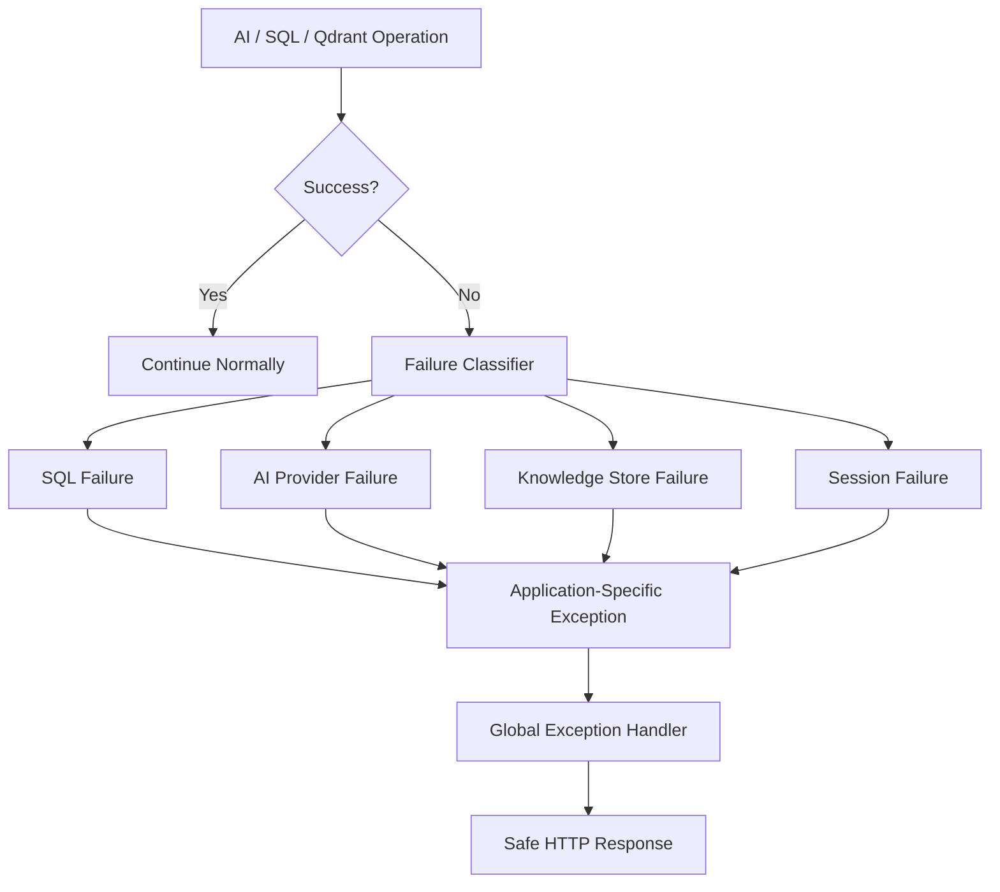

## Why

Low-level errors should not leak directly to users.

Example:

```text
TaskCanceledException
```

becomes:

```text
"The AI service is temporarily unavailable."
```

---

# 19. Observability Flow

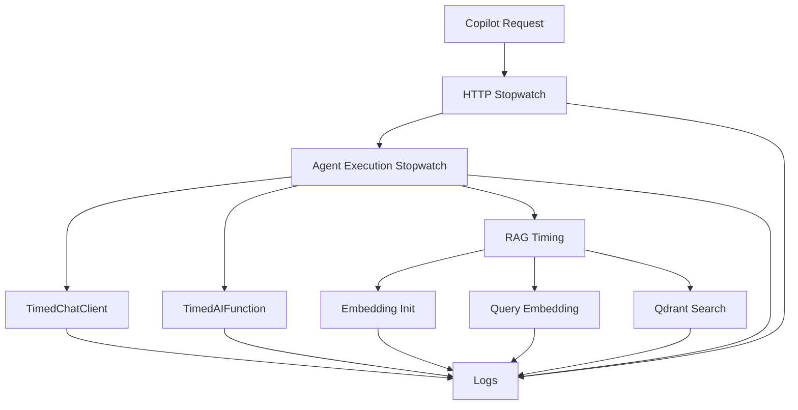

## Concepts Used

```text
TimedChatClient
TimedAIFunction
ILogger
Stopwatch
```

## Purpose

Instead of:

```text
"AI is slow"
```

you can determine:

```text
LLM = 20s
Qdrant = 2s
SQL = 50ms
Tool = 100ms
```

This makes optimization evidence-based.

---

# 20. MAF Workflow Architecture

The enrollment process uses a deterministic workflow.

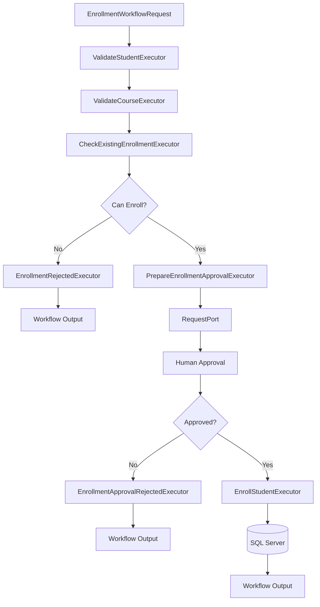

---

# 21. What Role AI Plays in the Workflow

Very little.

That is intentional.

The workflow itself is:

```text
Deterministic C# logic
+
MAF Workflow orchestration
+
Human approval
```

The LLM does **not** decide:

```text
Should the student be validated?
Should the course be validated?
Should duplicates be checked?
```

These are known business rules.

This is one of the most important architecture lessons:

> Use AI for uncertain reasoning. Use deterministic code for deterministic business rules.

---

# 22. Workflow Concepts Used

| Concept | Role |
|---|---|
| `WorkflowBuilder` | Builds the workflow graph |
| `Executor<TInput,TOutput>` | One processing step |
| Edge | Connects steps |
| Conditional Edge | Chooses branch based on data |
| `RequestPort` | Requests external/human input |
| `RequestInfoEvent` | Tells app workflow is waiting |
| `StreamingRun` | Runs workflow while exposing events |
| `WorkflowOutputEvent` | Final workflow result |
| `SuperStepCompletedEvent` | Step boundary |
| `CheckpointManager` | Creates/restores checkpoints |
| `CheckpointInfo` | Identifies saved checkpoint |
| `ResumeStreamingAsync` | Resumes workflow from checkpoint |
| `SendResponseAsync` | Sends human response back |

---

# 23. Workflow HITL Flow

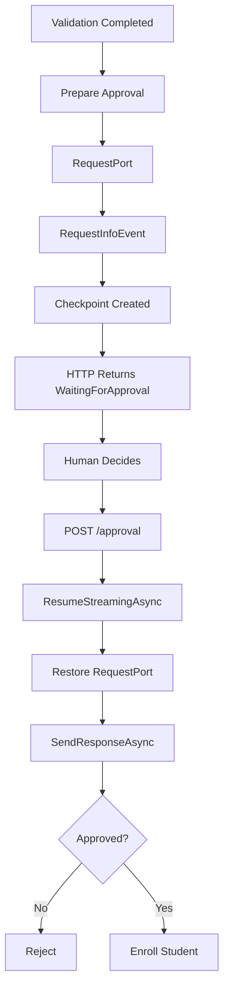

---

# 24. Why Workflow HITL Is Better Than Keeping HTTP Open

Bad design:

```text
Start Workflow
   ↓
Wait for human
   ↓
HTTP request remains open for minutes ❌
```

Better design:

```text
Start Workflow
   ↓
Request approval
   ↓
Checkpoint
   ↓
Return HTTP response
```

Later:

```text
Approval Request
   ↓
Resume Workflow
```

This makes the process suitable for real applications.

---

# 25. Checkpoint Flow

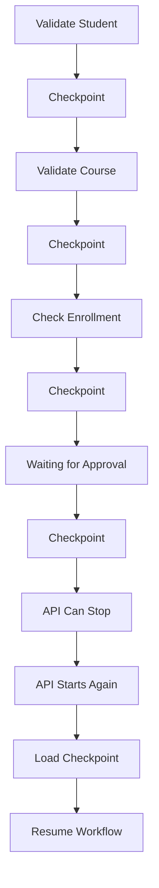

## Why Checkpoints Help

They allow:

```text
Pause
Restart
Resume
```

without repeating the entire business flow.

---

# 26. Durable Workflow SQL Architecture

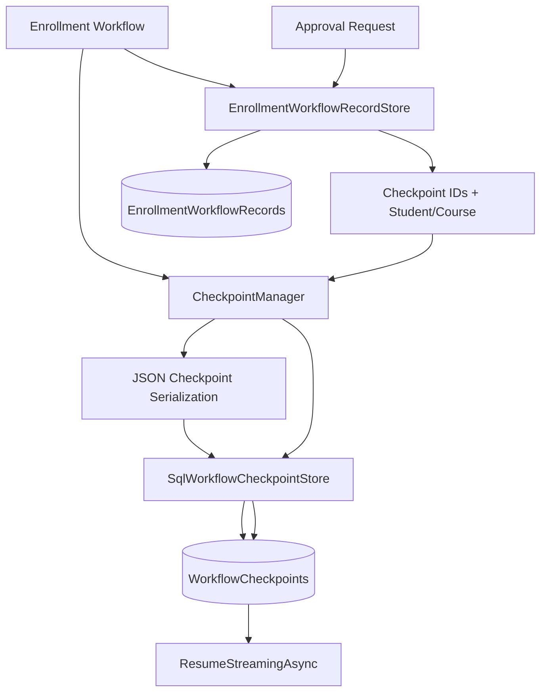

---

# 27. Why Two Workflow Tables Exist

## EnrollmentWorkflowRecords

Application/business metadata:

```text
RequestId
StudentId
CourseId
Status
CheckpointRunId
CheckpointId
CreatedAt
UpdatedAt
CompletedAt
```

## WorkflowCheckpoints

MAF framework state:

```text
SessionId / RunId
CheckpointId
ParentCheckpointId
CheckpointData
```

They should remain separate because:

```text
EnrollmentWorkflowRecords
= business process information

WorkflowCheckpoints
= framework execution state
```

---

# 28. Complete AI Example — Attendance Eligibility

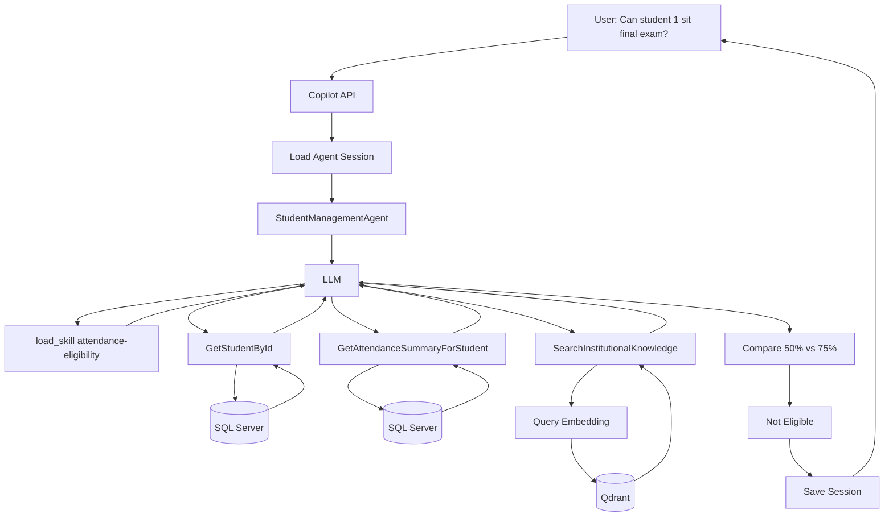

## Concept Map

```text
Agent
→ orchestrates

LLM
→ reasons and chooses tools

Skill
→ gives task-specific reasoning instructions

SQL Tools
→ provide live attendance

RAG
→ provides policy

Qdrant
→ retrieves relevant document chunks

Session Store
→ preserves conversation
```

---

# 29. Complete AI Example — Fee Review

User:

```text
"Review student 1's fee status and whether it affects exam eligibility."
```

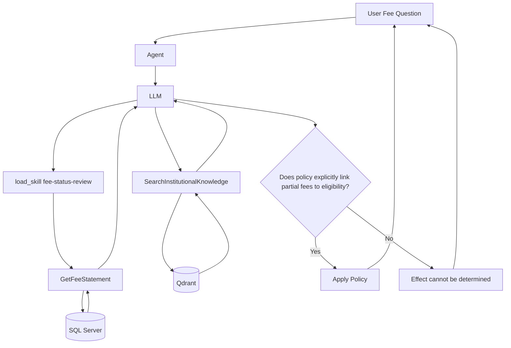

---

# 30. Complete Workflow Example — Durable Enrollment

> **Current implementation note:** The durable Enrollment Workflow is implemented as a separate deterministic workflow capability. The Copilot's current `enroll_student` tool still follows the normal tool → service path after agent-level HITL approval. Routing Copilot enrollment requests into this durable workflow is planned next.


```mermaid
flowchart TD

    USER[Start Enrollment 16 -> Course 2]

    USER --> API1[POST /enrollment-workflow]

    API1 --> VS[ValidateStudentExecutor]
    VS --> VC[ValidateCourseExecutor]
    VC --> CE[CheckExistingEnrollmentExecutor]

    CE --> CAN{Can Enroll?}

    CAN -->|No| REJECT1[EnrollmentRejectedExecutor]
    REJECT1 --> OUT1[Completed]

    CAN -->|Yes| PREP[PrepareEnrollmentApprovalExecutor]
    PREP --> PORT[RequestPort]

    PORT --> REQ[RequestInfoEvent]
    REQ --> CP[Checkpoint Saved to SQL]

    CP --> META[EnrollmentWorkflowRecord Saved]
    META --> RESP[HTTP: WaitingForApproval + RequestId]

    RESP --> STOP[API Can Restart]

    STOP --> API2[POST /approval]

    API2 --> LOOKUP[Load Workflow Record]
    LOOKUP --> CPI[Rebuild CheckpointInfo]
    CPI --> LOADCP[Load SQL Checkpoint]

    LOADCP --> RESUME[ResumeStreamingAsync]
    RESUME --> RESTORED[RequestPort Restored]

    RESTORED --> HUMAN{Approved?}

    HUMAN -->|No| REJECT2[EnrollmentApprovalRejectedExecutor]
    REJECT2 --> STATUS1[Status = Rejected]

    HUMAN -->|Yes| ENROLL[EnrollStudentExecutor]
    ENROLL --> SERVICE[IEnrollmentService]
    SERVICE --> SQL[(Enrollments Table)]
    SQL --> STATUS2[Status = Completed]
```

---

# 31. Where AI Is Used vs Not Used

## AI Is Used For

```text
Understanding natural language
Deciding which tool to use
Deciding whether a skill is relevant
Combining multiple evidence sources
Explaining results
Reasoning about retrieved policy
```

## AI Is Not Used For

```text
SQL queries directly
Business rule enforcement
Authentication
Authorization
Duplicate enrollment rules
Checkpoint persistence
Database writes directly
Workflow branch correctness
Human approval decisions
```

---

# 32. Why This Architecture Is Useful

The biggest benefit is **separation of responsibility**.

```text
LLM
→ flexible reasoning

Agent
→ AI orchestration

Tools
→ safe application capabilities

Skills
→ reusable domain guidance

RAG
→ external institutional knowledge

Workflow
→ deterministic business process

Human
→ approval authority

SQL
→ source of truth and persistence
```

Instead of building:

```text
One giant AI chatbot that controls everything
```

the system becomes:

```text
AI where reasoning helps
+
normal code where determinism matters
+
human control where authorization matters
```

---

# 33. Final Mental Model

Remember these simple definitions:

```text
LLM
= Think

Agent
= Decide what capability to use

Tool
= Do one thing

Skill
= Know how to handle a type of task

RAG
= Look up external knowledge

Workflow
= Follow a controlled process

HITL
= Ask a human before sensitive action

Checkpoint
= Save workflow progress

Session
= Remember conversation state

SQL
= Store authoritative and durable state
```

---

# 34. Final AI Flow Summary

The current system has a primary conversational AG-UI agent path and a separate deterministic Enrollment Workflow path.

```mermaid
flowchart TD

    USER[User] --> ANG[Angular Application]

    ANG -->|Conversational / Copilot Request| AGUI[AG-UI Endpoint]
    AGUI --> AUTH[JWT + Claims Isolation]
    AUTH --> HOSTED[Hosted AIAgent]

    HOSTED --> LLM[LLM]
    HOSTED --> SESSION[(Agent Sessions)]

    LLM --> HTOOLS[Hosted Tools]
    HTOOLS --> EXEC[ScopedToolExecutor]
    EXEC --> TOOLS[Business Tools]
    TOOLS --> SERVICES[Application Services]
    SERVICES --> SQL[(SQL Server)]

    LLM --> SKILLS[Skills]
    LLM --> RAG[RAG]
    RAG --> QDRANT[(Qdrant)]

    LLM --> HITL1[Agent HITL]
    HITL1 --> HUMAN1[Human]
    HUMAN1 --> HOSTED

    ANG -->|Deterministic Enrollment Workflow API| WF[MAF Enrollment Workflow]
    WF --> EXECUTORS[Executors + Edges]
    EXECUTORS --> HITL2[Workflow RequestPort HITL]
    HITL2 --> HUMAN2[Human]
    HUMAN2 --> WF

    WF --> CHECKPOINT[CheckpointManager]
    CHECKPOINT --> SQLCP[(WorkflowCheckpoints)]
    WF --> WFMETA[(EnrollmentWorkflowRecords)]

    HOSTED --> RESPONSE[AG-UI Streaming Response]
    WF --> WFRESPONSE[Workflow Result / Waiting State]

    RESPONSE --> ANG
    WFRESPONSE --> ANG
```

Today these two paths coexist. A planned integration will let the Copilot resolve the student/course in natural language and then launch the durable Enrollment Workflow instead of directly executing `enroll_student`.

---

# 34A. Current Implementation vs Planned Integration

## Implemented Now

- Named singleton MAF hosted `AIAgent`
- AG-UI endpoint for the Angular Copilot
- JWT authentication
- Claims-based hosted-agent session isolation
- SQL-backed persistent agent sessions
- Conversation history/index metadata with pagination, rename, switch, and delete behavior
- Tool calling through `AIFunctionFactory.Create(...)`
- Hosted-tool proxy architecture with `ScopedToolExecutor`
- Read tools across students, courses, enrollments, attendance, fees, and institutional knowledge
- Approval-required write tools using `ApprovalRequiredAIFunction`
- Student and course creation tools with HITL
- Agent Skills
- RAG with local embeddings and Qdrant
- Observability wrappers such as `TimedChatClient` and `TimedAIFunction`
- AI-provider / knowledge / session failure handling
- Separate durable Enrollment Workflow
- Workflow `RequestPort` HITL
- SQL workflow checkpoints and enrollment workflow metadata/history persistence

## Not Yet Connected

The following flow is **not implemented yet**:

```text
Copilot natural-language enrollment request
        ↓
Resolve student + course
        ↓
Start durable Enrollment Workflow
        ↓
Workflow validation
        ↓
Workflow HITL
        ↓
Durable completion
```

The current Copilot enrollment path is:

```text
Copilot
  ↓
enroll_student
  ↓
ApprovalRequiredAIFunction
  ↓
Human approval
  ↓
EnrollmentTools
  ↓
IEnrollmentService
  ↓
SQL Server
```

Keeping this distinction explicit prevents the documentation from describing planned architecture as if it already exists.

---

# 34B. AI Roadmap

The next improvements build on the architecture already implemented:

1. **AG-UI live activity/progress UI** — show tool execution such as searching, checking, retrieving, waiting for approval, and completing.
2. **Copilot → Enrollment Workflow integration** — replace direct Copilot enrollment execution with the durable workflow for that business process.
3. **Workflow step progress in AG-UI** — surface validation, duplicate checking, approval waiting, and enrollment completion in the same activity timeline.
4. **Agent-as-a-Tool patterns** — introduce specialized agents only where they add clear value.
5. **Multi-agent orchestration** — coordinate specialized academic, attendance, finance, or policy agents for larger tasks.
6. **Planner / dynamic task decomposition** — explore goal-driven planning for genuinely open-ended administrative tasks.
7. **MCP integration** — optional future interoperability with external tool servers where useful.

The design principle remains:

```text
Use tools for bounded capabilities.
Use workflows for deterministic processes.
Use AI for uncertain reasoning and orchestration.
Use humans for authorization-sensitive decisions.
```

---

# 35. One-Sentence Architecture Summary

> The Student Management AI layer uses a **hosted MAF agent over AG-UI** for conversational orchestration, the **LLM for understanding and reasoning**, **hosted/scoped tools for authoritative application operations**, **skills for reusable domain guidance**, **RAG and Qdrant for institutional knowledge**, **MAF workflows for deterministic business processes**, **HITL for human authorization**, **claims-based isolation for per-user agent sessions**, and **SQL-backed sessions/checkpoints for durable state**.
